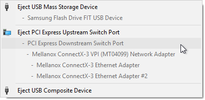

# eject-tbt
Windows utility to eject external PCIe devices (connected via thunderbolt adapter)



To build you will need zig version **0.10.1**. Download it from [here](https://ziglang.org/download/#release-0.10.1).
After downloading source code, run:

```
zig build -Drelease-safe
```
